[](https://signaloid.io/repositories?connect=https://github.com/signaloid/Signaloid-Demo-Batteries-StateOfChargeEstimation#gh-dark-mode-only)
[](https://signaloid.io/repositories?connect=https://github.com/signaloid/Signaloid-Demo-Batteries-StateOfChargeEstimation#gh-light-mode-only)

# State of Charge Estimation in Batteries
The State of Charge (SoC) of a battery expresses its remaining capacity as a percentage of its total capacity. 
Accurately estimating the State of Charge is crucial in battery-powered systems. For example, an autonomous drone must have that information to decide when to return for recharging.

The State of Charge is usually estimated from a combination of battery voltage and system current. Measurement uncertainty and production process variability lead to uncertainties in the state of charge estimate. Systems that accurately track this uncertainty can make better decisions, as illustrated below.


## 1: Directly Mapping Voltage to State of Charge
### Background
As the battery is discharged its output voltage decreases. The figure below shows the discharge curve of a Panasonic CGR-17500 cell. The steep start, flat middle, and steep end is characteristic of the Li-Ion chemistry. In the absence of measurement uncertainty, the state of charge can be determined exactly from the voltage[^Caveats]. Unfortunately, the estimate is sensitive to noise. Even small uncertainties in voltage can translate to large uncertainties in state of charge, as the animation below shows. A blanket safety margin won't accurately reflect the true uncertainty as the animation below also shows.

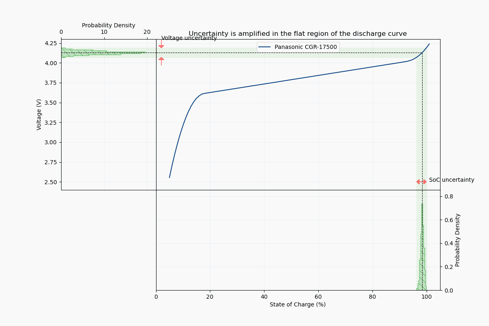
### Running the demo
 The function <code>[voltageToSoc()](./src/batt.c#L162)</code> in <code>[src/batt.c](./src/batt.c)</code> encodes the above characteristic. Normally this function would take a single voltage value as input and return a single percentage value as output. To start tracking uncertainty, we simply assign a suitable distribution to the input voltage and the Signaloid platform will correctly propagate this to the state of charge estimate (in practice the voltage distribution could be obtained by oversampling).

```
...
voltage = UxHwDoubleGaussDist(μV, σV)
soc     = voltageToSoc(voltage)
...
```
Running the above for mean voltages of 2.7V and 3.8V and a standard deviation of 10mV results in the below distributions for state of charge. As expected, the uncertainty is much larger for the voltage corresponding to the flat part of the characteristic (bottom-right plot).

Voltage (10mV std)         |  SoC
:-------------------------:|:-------------------------:
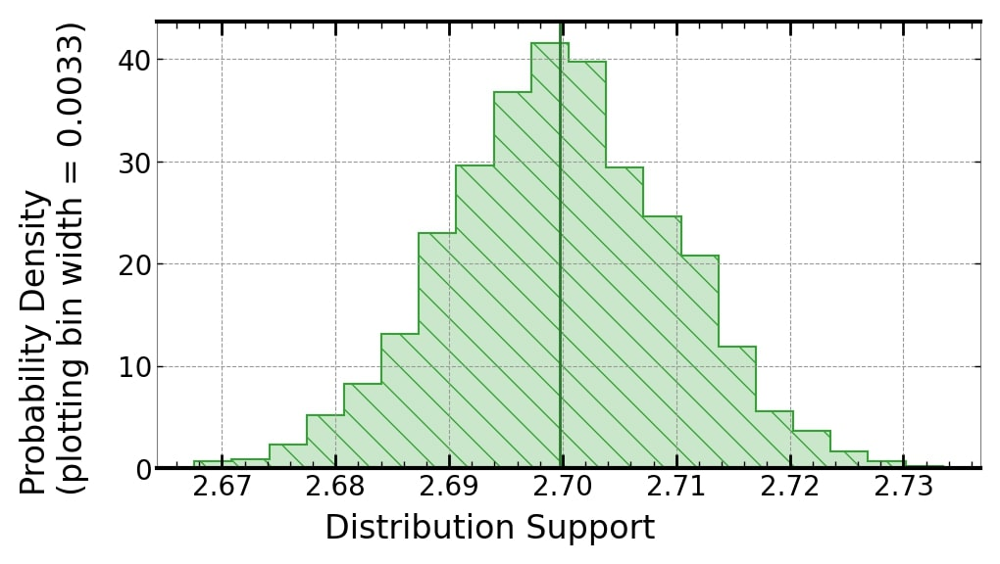  |  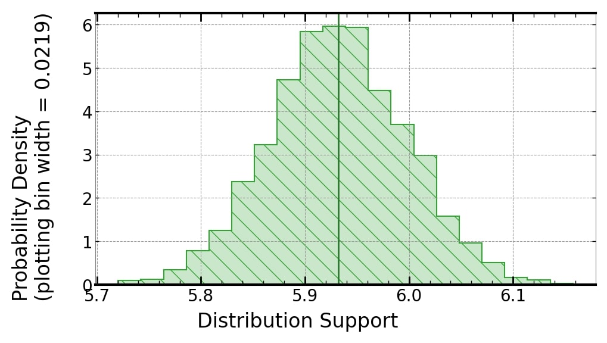
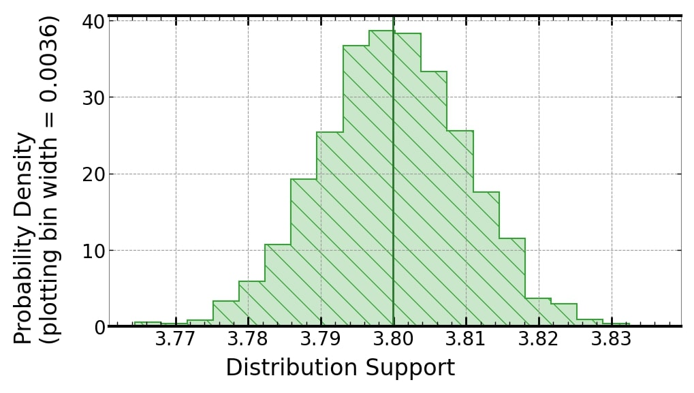  |  

[^Caveats]: Ignoring the effects of temperature, discharge rate, number of cycles etc.

## 2: Coulomb Counting
### Background
Coulomb Counting methods estimate the state of charge by integrating the current over time. At each step, the change in state of charge is calculated as 
$\Delta \textrm{SoC} = \frac{I\Delta t}{C} \times 100$ where $I$ is the measured current, $\Delta t$ is the time step and $C$ is the total capacity in ampere-seconds. Coulomb counting preserves continuity and avoids the uncertainty amplification of direct voltage mapping. Unfortunately, the uncertainty in the current measurement accumulates over time and the estimate deteriorates as show in the figure below.

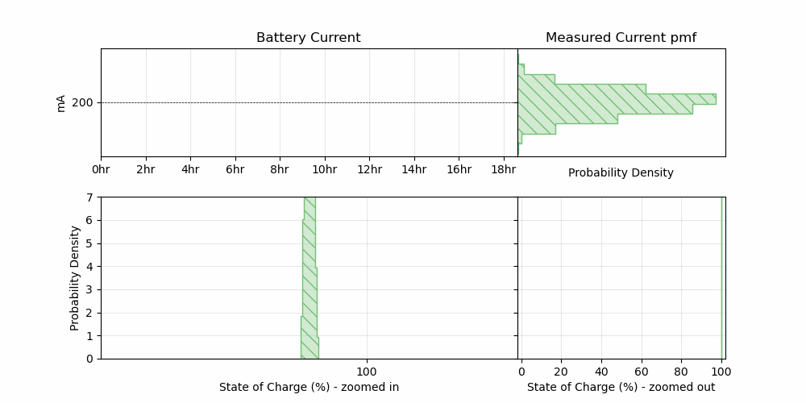
The state of charge reference is often reset when the battery is fully charged. However, if the battery goes through many partial charge cycles this is not possible and the drift may exceed acceptable tolerances.

### Battery model
The battery state is updated by the function <code>[batteryUpdate()](./src/batt.c#L32)</code> in <code>[src/batt.c](./src/batt.c#L32)</code>. Normally this would take non-distribution inputs of time and instantaneous current and return a non-distributional output of state of charge. To track uncertainty, we simply assign a suitable distribution to the current measurement.

The *true* current is sampled from a uniform distribution between 0 and 300mA. The *measured* current is given by a noisy measurement of the true current. The noisy measurement is passed to the battery model and the uncertainty is propagated to the state of charge output.

### Running the demo
The distributions below show the estimates for a discharge from 100% state of charge. The current measurement is subject to gaussian noise with a standard deviation of 1mA. As expected the uncertainty in the estimate grows over time.

  SoC = 96.5%  (std = ~0.03%)|  SoC = 18.5% (std = ~0.5%)
:-------------------------:|:-------------------------:
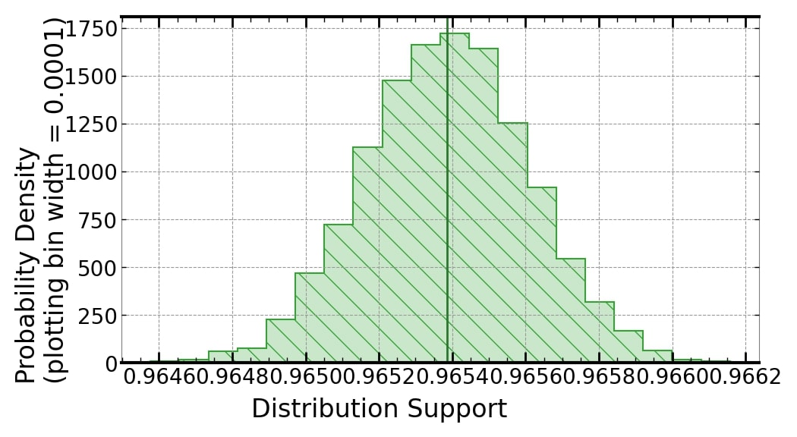   | 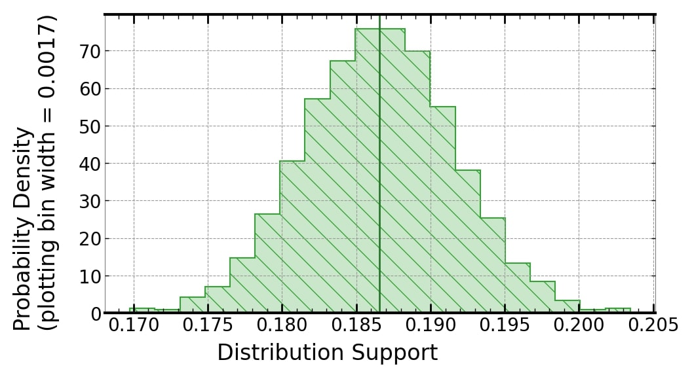


## 3: Bayesian Approach
### Background
A better estimation method combines both coloumb counting and direct voltage mapping. The contribution of each estimate needs to be adjusted according to its associated uncertainty. For example, the direct mapping estimate is very inaccurate on the flat parts of the discharge curve and should have a reduced influence in this region. 

[Bayesian inference](https://en.wikipedia.org/wiki/Bayesian_inference) is a technique that achieves the optimal combination of the two estimates. In bayesian terminology, the inital belief or *prior distribution* over state of charge at the start of each estimation step is the output of the coloumb counting model. This belief is *updated* based on a measurement of the voltage and its associated *likelihood* function. The resulting *posterior distribution* is a better estimate of the state of charge. The posterior is passed as the new state to the coloumb counting model and the steps repeat as shown in the animation below.

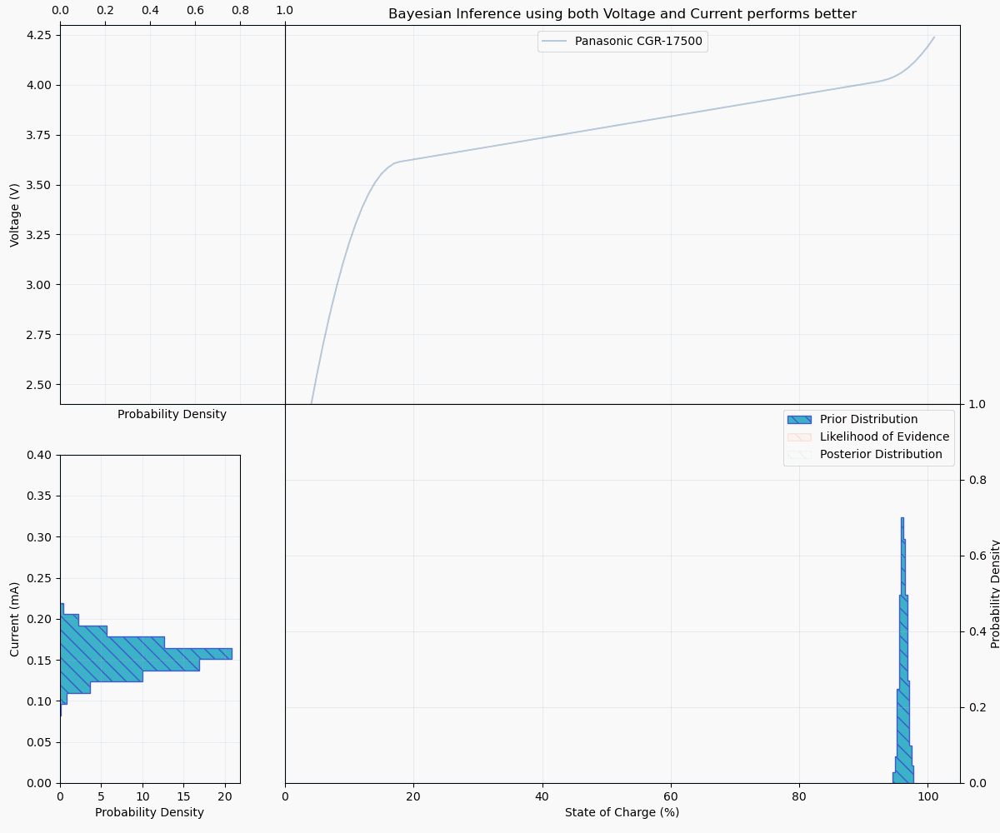

### Running the demo
The first step proceeds exactly like method 2, a state of charge distribution is computed using the coloumb counting model. However, instead of using this distribution directly as the input for the next step the estimate is improved by conditioning it on a measurement of the battery voltage. The bayesian inference is done on a single line using:

```
posterior = UxHwDoubleBayesLaplace(&likelihood, prior, evidence)
```
The likelihood function is given by the <code>[voltageSensor()](./src/estimation.c#L34)</code> transformed through the discharge characteristic. The evidence is a single measurement of the voltage transformed into a state of charge measurement through the discharge characteristic.

  Prior |  Posterior
:-------------------------:|:----------------------:
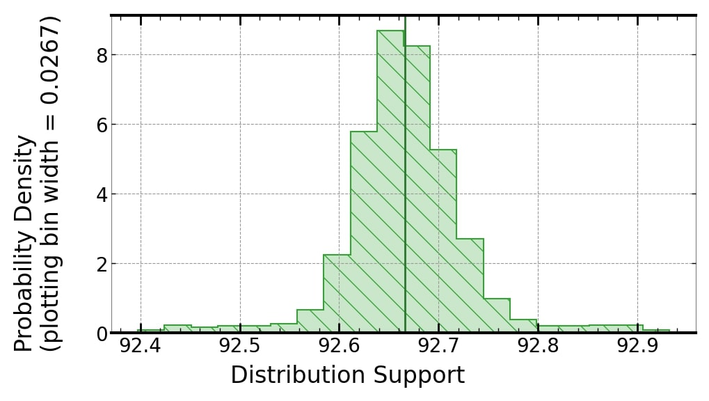   | 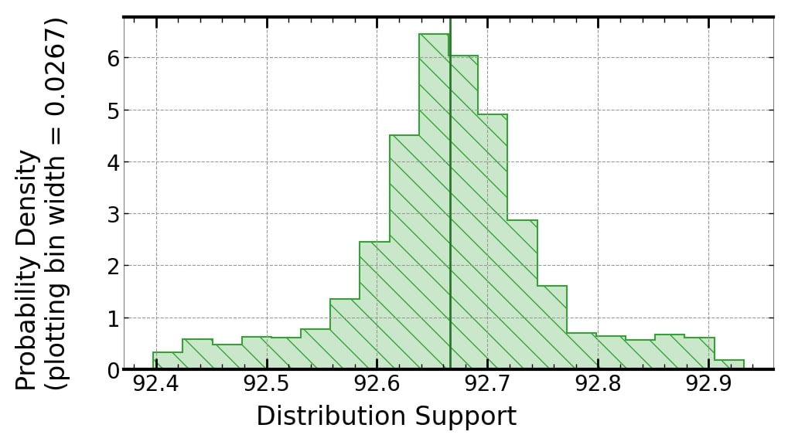  
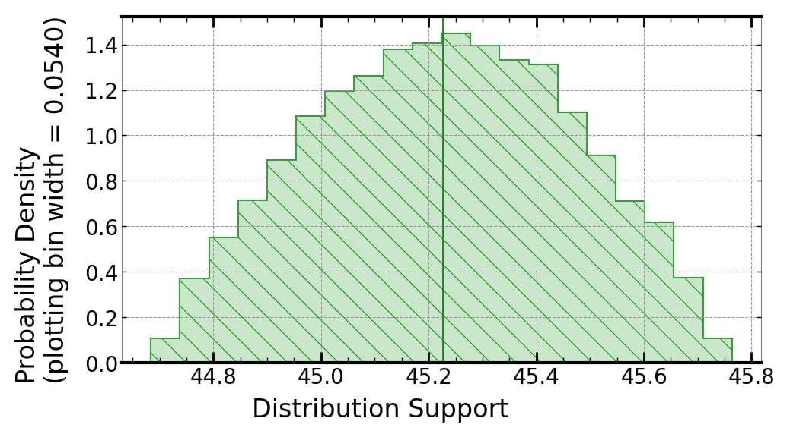   | 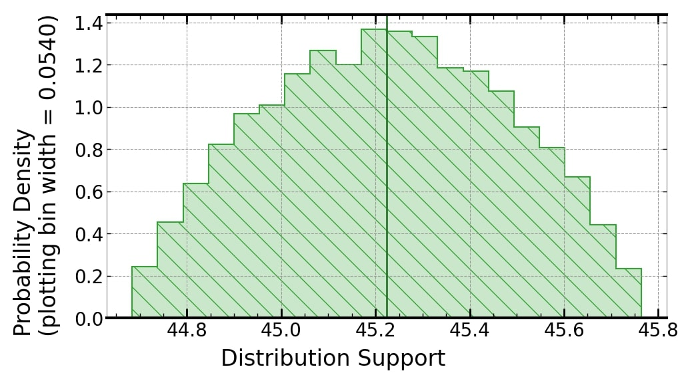  
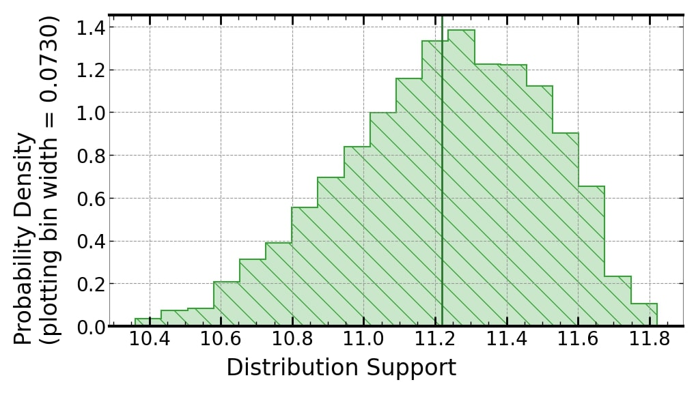   | 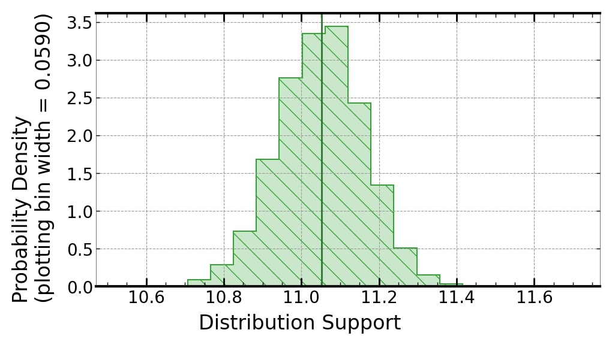  

As expected, the posterior distribution is noticeably narrower in the steep part of the discharge curve where direct voltage mapping is highly informative. The uncertainty in the estimate is smaller in all regions when compared with method 1 and 2 as this approach incorporates the information from both.

# Repository Tree Structure
```
.
├── LICENSE
├── src
│   ├── batt.c
│   ├── README.md
│   ├── estimation.c
│   ├── main.c
│   ├── estimation.h
│   └── batt.h
├── resources
│   ├── README.md
│   ├── method2
│   │   ├── coloumbWide.jpg
│   │   ├── animation.gif
│   │   └── coloumbNarrow.jpg
│   ├── method3
│   │   ├── soc45_prior.jpg
│   │   ├── soc11.jpg
│   │   ├── soc93.jpg
│   │   ├── animation.gif
│   │   ├── soc93_prior.jpg
│   │   ├── soc45.jpg
│   │   └── soc11_prior.jpg
│   ├── droneExample.jpg
│   └── method1
│       ├── directMappingSoc27.jpg
│       ├── animation.gif
│       ├── directMappingVoltage27.jpg
│       ├── directMappingSoc38.jpg
│       └── directMappingVoltage38.jpg
└── README.md
```

[^BeniniBatteryModel]: Benini, L. et al. (2000). “A discrete-time battery model for high-level power estimation”. In: Proceedings of the conference on Design, automation and test in Europe, pp. 35–39. 
