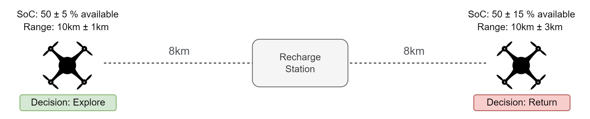
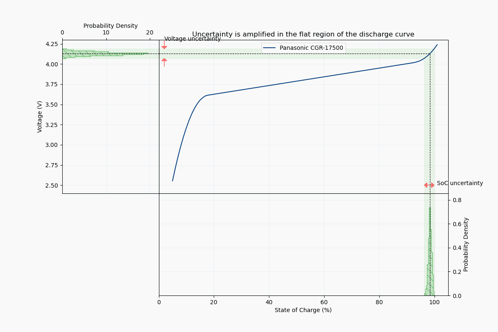
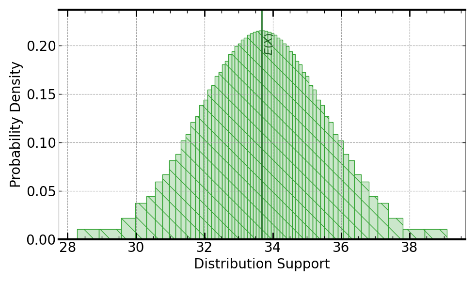

[](https://signaloid.io/repositories?connect=https://github.com/signaloid/Signaloid-Demo-Batteries-StateOfChargeEstimation#gh-dark-mode-only)
[](https://signaloid.io/repositories?connect=https://github.com/signaloid/Signaloid-Demo-Batteries-StateOfChargeEstimation#gh-light-mode-only)

# State of Charge Estimation in Batteries
The State of Charge (SoC) of a battery expresses its remaining capacity as a percentage of its total capacity. 
Accurately estimating the State of Charge is crucial in battery-powered systems. For example, an autonomous drone must have that information to decide when to return for recharging.

The State of Charge is usually estimated from a combination of battery voltage and system current. Measurement uncertainty and production process variability lead to uncertainties in the state of charge estimate. Systems that accurately track this uncertainty can make better decisions, as illustrated below.



## Directly Mapping Voltage to State of Charge
As the battery is discharged its output voltage decreases. The figure below shows the discharge curve of a Panasonic CGR-17500 cell. The steep start, flat middle, and steep end is characteristic of the Li-Ion chemistry. In the absence of measurement uncertainty, the state of charge can be determined exactly from the voltage[^Caveats]. Unfortunately, the estimate is sensitive to noise. Even small uncertainties in voltage can translate to large uncertainties in state of charge, as the animation below shows. A blanket safety margin won't accurately reflect the true uncertainty as the animation below also shows.



## Getting started
The correct way to clone this repository to get the submodules is:
```sh
	git clone --recursive git@github.com:signaloid/Signaloid-Demo-Batteries-StateOfChargeEstimation.git
```

If you forgot to clone with `--recursive` and end up with empty submodule directories, you can remedy this with:
```sh
	git submodule update --init
```

## Running the application on the Signaloid Cloud Developer Platform
To run this application on the [Signaloid Cloud Developer Platform](https://signaloid.io),
you need a Signaloid account. You can sign up for a Signaloid account using [this link](https://get.signaloid.io).

Once you have a Signaloid account, you can click the "add to signaloid.io" button at the
top of this `README.md` to connect this repository to the Signaloid Cloud Developer Platform
and run the application.

## Running the application locally
Apart from using Signaloid's Cloud Compute Platform, you can compile and run this application
locally. Local execution is essentially a native Monte Carlo implementation,
that uses GNU Scientific Library[^GSL] to generate samples for the different input distributions.
In this mode the application stores the generated output samples, in a file called `data.out`.
The first line of `data.out` contains the execution time of the Monte Carlo implementation
in microseconds (μs), and each next line contains a floating-point value corresponding to an output sample value.

In order to compile and run this application in the native Monte Carlo mode:

0. Install dependencies (e.g., on Linux):
```
sudo apt-get install libgsl-dev libgslcblas0
```
1. Compile natively (e.g., on Linux):
```
cd src/
gcc -I. -I/opt/local/include main.c batt.c utilities.c common.c uxhw.c -L/opt/local/lib -o native-exe -lgsl -lgslcblas -lm
```
2. Run the application in the MonteCarlo mode, using (`-M`) command-line option:
```
./native-exe -M 10000
```
The above program runs 10000 Monte Carlo iterations.
3. See the output samples generated by the local Monte Carlo execution:
```
cat data.out
```

## Inputs
The only input to the state of charge estimation application is the measured voltage provided with the
command-line flag `-V`. If the value provided with `-V` is particle valued (i.e., not distributional),
then the output of the application will also be particle valued. However, with Signaloid microarchitectures
it is also possible to input distributional values using what is called
[Ux-Strings](https://docs.signaloid.io/docs/hardware-api/ux-data-format/), which are string encodings
of representations of distributions used by Signaloid microarchitectures. With such a distributional
value provided with the command-line flag `-V`, the output of the application will also be a distributional
value.

## Outputs
The output of the state of charge estimation application is the state of charge estimate of the
Panasonic CGR-17500 battery cell for the input measured voltage. 

Following is an example output, using Signaloid's C0Pro-XL+ core, for the default input:



## Usage
```
Example: Battery state estimation routines - Signaloid version

Usage: Valid command-line arguments are:
        [-o, --output <Path to output CSV file : str>] (Specify the output file.)
        [-M, --multiple-executions <Number of executions : int> (Default: 1)] (Repeated execute kernel for benchmarking.)
        [-T, --time] (Timing mode: Times and prints the timing of the kernel execution.)
        [-b, --benchmarking] (Benchmarking mode: Generate outputs in format for benchmarking.)
        [-j, --json] (Print output in JSON format.)
        [-h, --help] (Display this help message.)
        [-V, --measuredVoltage <Measured voltage of battery : double> (Default: Gauss(3.70, 0.01))] (Set input measured voltage.)
```


---

<br/>
<br/>
<br/>

[^Caveats]: Ignoring the effects of temperature, discharge rate, number of cycles etc.

[^GSL]: [GNU Scientific Library](https://www.gnu.org/software/gsl/).
